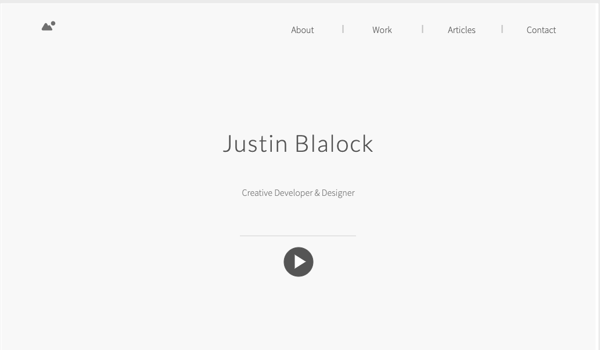
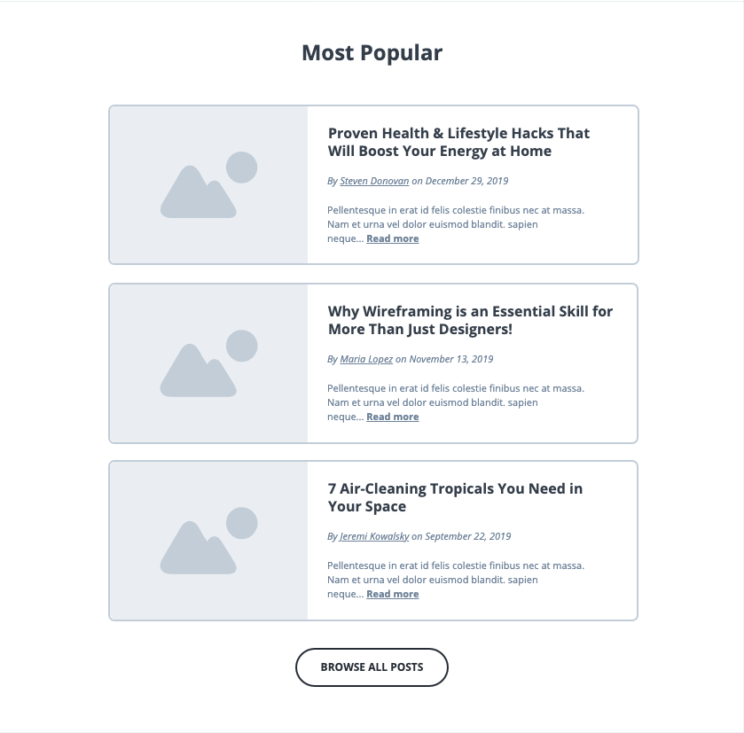
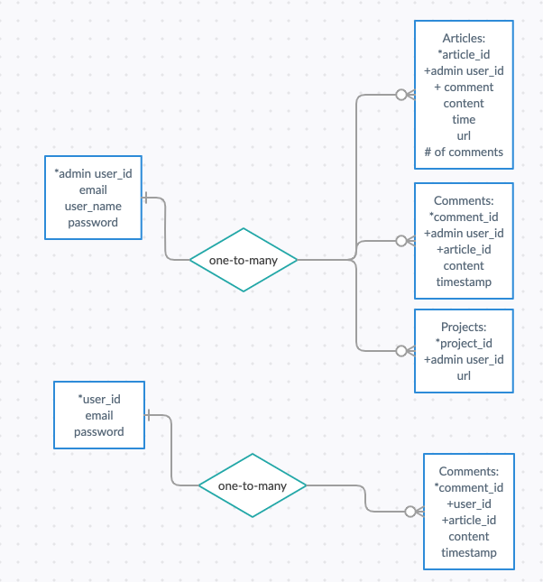

# la-seir-9-8-final-project

<!-- Link to hosted App TBD -->

# CS Blogger Portfolio

A hosted webpage for a user to showcase thier computer science code projects, blog about their computer science learnings and provide an about section where people can connect.

## Index:

- [Installation](#Installation)
- [Scope](#Scope)
- [User Stories](#user-stories)
- [Wireframes](#wireframes)
- [Data Models](#data-models)
- [Milestones](#milestones)

## Installation

<!-- Installation Instructions TBD -->

## Scope

The final objective is to build a website where a primary user can track thier published articles and external comments associated to those articles.  Primary users will be able to create, edit, delete and update thier own articles and moderate the corresponding external comments on those articles. Primary users will be able to update their project showcase page with visual previews and links to the respective repositories.

Refer to milestones for full sprints breakdown.

##### Technologies in play

- Mongoose
- Express
- React
- Node.js

## User Stories

A CS Blog/Portfolio primary user can use this app to showcase projects, track articles and comments, to help them manage their professional coding portfolio and blog.

#### Non-authenticated Users can:

- View: 
	- Portfolio page
	- Articles page
	- Article details page
	- About page
- Sign-up in order to post comments

#### Authenticated users can

- Search for articles
- Post comments on articles
- Delete and edit comments on articles

#### Admin users can

- Create articles
- Read/View articles' details
- Update/Edit articles content
- Delete articles
- Approve comments

## Wireframes

### Landing/Home Page

Users will see the landing page with the author's work. Users will see navigation options for:

- 'Home' 
- 'Articles' 
- 'About' 
- 'Contact'

### Registration/Log-in Page

Users who want to post comments will be guided to a registration page requiring an email address and password.

### Articles Page

Admin users will be able to author articles that can then be subjected to commentary from non-admin logged-in users.

This will allow the admin user to input Article data, as well as have access to edit past Articles and moderate comments.  These articles will be visible with hyperlinks to view article and comment details.

Regular users will be able to post, update and delete comments on articles authored by the admin user.  Comments will be held in an 'awaiting moderation' status until approved by the primary admin.

### Show Article Page

Details each article by: (name, date/time, comments)

View 1

## Data Models

### User

- userId
- name
- email
- password
- imgURL
- joined on

### Article

- title
- content
- created_on

### Comment

- username
- body
- created_on
- article (FK->Article)

### Reviews (stretch goal, inter app sharing between users, posting to social)

- comment moderation
- content api (box.com)
- user welcom email / validation

## Milestones

## Sprint 1: Basic Auth & Profiles

**A user should be able to:**

1. Navigate to "/" and see a basic splash page with:

- The name of the website.
- Links to "Log In" and "Sign Up".

2. Sign up for an account.
3. Log in to their account if they already have one.
4. Be redirected to the articles page
5. On their profile page, see their name, the current city they have set in their profile, and their join date.
6. See the site-wide header on every page with:

- A link to "Log Out" if they're logged in.
- Links to "Log In" and "Sign Up" if they're logged out.

7. Update their profile by making changes to their username or email.
8. See the links of all the comments they've authored.
9. Click on the title of one of their comments and be redirected to a "show" page for that post.
10. View post "show" pages with title, author, and content.

## Sprint 2: CRUD

**A user should be able to:**

1. View the "Articles" page (at "/articles/1") including:

- The site-wide nav.
- The name of the article.
- Article Body.

2. View a list of articles on the Articles page:

- Sorted by newest first.
- With the post titles linked to the individual article "show" pages.

3. Admin user can use an "Add New article" button on the Articles page to pull up the new article form.
4. Admin user can Create a new Article.
5. Click "Edit" on ANY individual article, and be redirected to the edit form.
6. Click "delete" on ANY individual article, then:
	- See a pop-up that says: "Are you sure you want to delete #{title}?"
	- If the user confirms, delete the post.

## Sprint 3: Validations & Authorization

**A user should be able to:**

1. View Article page
2. Verify that a new comment is posted to an Article.

A user CANNOT save invalid data to the database, according to the following rules:

3. A user CANNOT sign up with an email (or username) that is already in use.
4. An Article's title must be between 1 and 200 characters.
5. A comment's content must not be empty.

A user is authorized to perform certain actions on the site, according to the following rules:

6. A user MUST be logged in to create/update/destroy resources.
7. A user may only edit their own profile and edit/delete their own comments.

## Sprint 4: Commenting

**A user should be able to:**

1. Comment on individual posts.
2. See the number of comments a post has on the post's "show" page.
3. See the number of comments they've left, on their public profile.
4. Only add a comment when logged in.
5. Only edit/delete their own comments.

# Getting Started with Create React App

This project was bootstrapped with [Create React App](https://github.com/facebook/create-react-app).

## Available Scripts

In the project directory, you can run:

### `npm start`

Runs the app in the development mode.\
Open [http://localhost:3000](http://localhost:3000) to view it in the browser.

The page will reload if you make edits.\
You will also see any lint errors in the console.

### `npm test`

Launches the test runner in the interactive watch mode.\
See the section about [running tests](https://facebook.github.io/create-react-app/docs/running-tests) for more information.

### `npm run build`

Builds the app for production to the `build` folder.\
It correctly bundles React in production mode and optimizes the build for the best performance.

The build is minified and the filenames include the hashes.\
Your app is ready to be deployed!

See the section about [deployment](https://facebook.github.io/create-react-app/docs/deployment) for more information.

### `npm run eject`

**Note: this is a one-way operation. Once you `eject`, you can’t go back!**

If you aren’t satisfied with the build tool and configuration choices, you can `eject` at any time. This command will remove the single build dependency from your project.

Instead, it will copy all the configuration files and the transitive dependencies (webpack, Babel, ESLint, etc) right into your project so you have full control over them. All of the commands except `eject` will still work, but they will point to the copied scripts so you can tweak them. At this point you’re on your own.

You don’t have to ever use `eject`. The curated feature set is suitable for small and middle deployments, and you shouldn’t feel obligated to use this feature. However we understand that this tool wouldn’t be useful if you couldn’t customize it when you are ready for it.

## Learn More

You can learn more in the [Create React App documentation](https://facebook.github.io/create-react-app/docs/getting-started).

To learn React, check out the [React documentation](https://reactjs.org/).

### Code Splitting

This section has moved here: [https://facebook.github.io/create-react-app/docs/code-splitting](https://facebook.github.io/create-react-app/docs/code-splitting)

### Analyzing the Bundle Size

This section has moved here: [https://facebook.github.io/create-react-app/docs/analyzing-the-bundle-size](https://facebook.github.io/create-react-app/docs/analyzing-the-bundle-size)

### Making a Progressive Web App

This section has moved here: [https://facebook.github.io/create-react-app/docs/making-a-progressive-web-app](https://facebook.github.io/create-react-app/docs/making-a-progressive-web-app)

### Advanced Configuration

This section has moved here: [https://facebook.github.io/create-react-app/docs/advanced-configuration](https://facebook.github.io/create-react-app/docs/advanced-configuration)

### Deployment

This section has moved here: [https://facebook.github.io/create-react-app/docs/deployment](https://facebook.github.io/create-react-app/docs/deployment)

### `npm run build` fails to minify

This section has moved here: [https://facebook.github.io/create-react-app/docs/troubleshooting#npm-run-build-fails-to-minify](https://facebook.github.io/create-react-app/docs/troubleshooting#npm-run-build-fails-to-minify)
